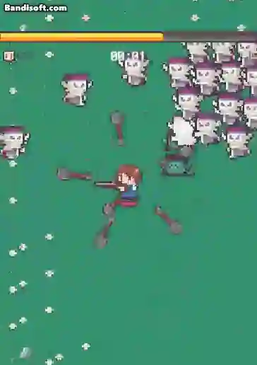

# Practice Making Game with Unity(zombie escape)
- 블서류 생존 게임 undead survivor를 clone coding을 통해 연습해보자
- zombie survivor game
  
<div align="center">
  


</div>

<div align="center">
<br>


</div>


## 플레이 화면

### 시작


```
히든 미션에 따라 새로운 캐릭터를 합류 시키는 시스템을 구현하였습니다.
각 캐릭터는 개인 특성을 가지고 있습니다.
```

</br>

### play


```
레벨업에 따른 무기 혹은 특성을 업그레이드 할 수 있는 시스템을 구현하였습니다.
게임 도중 캐릭터가 해방되면 오른쪽 알람, Notice 창이 뜨고 5초 후에 제거되는 방식으로 구현하였습니다.
```

</br>

### fin


```
게임 Clear
```

</br>

### fail


```
게임 Fail
```

</br>
  
### mobilebuild


```
모바일로 구현하기 위해 joystick을 구현하고 application을 종료시키는 버튼과 시스템을 구현하였습니다.
```
